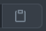

<!-- @format -->

# 📑 Lista De Afazeres!

## _Exemplo simples de como fazer um TODOLIST, ou, Lista de Afazeres!_

**Quer saber como faz para pegar esse projeto e colocar no seu? Simples, siga esses passos abaixo:**

1. Primeiro, clique em um botão **Verde** chamado `Code`.
2. Agora, clique em um ícone parecido com esse:

 

3. Após ter feito isso, você terá copiado o link desse GitHub automaticamente.
4. Agora, abre uma pasta de sua **Preferência** e dentro dela, abra o `Prompt de Comando` ou `Windows PowerShell`.
5. No seu `Prompt de Comando` ou `Windows PowerShell`, e você irá digitar o seguinte:
    - Obs: Ao invés de escrever `<ctrl + c>`, você irá usar o atalho **Ctrl + C**!

```js
git clone <ctrl + c>
```

6. Agora que você fez tudo isso, só aguardar...
7. Após ter terminado de clonar esse **Repositório**, você irá abrir essa pasta no seu `Editor de Código` e começar a trabalhar 😁!

# 📝 Editores para Trabalho!

| Nome                 | Link                                     |
| -------------------- | ---------------------------------------- |
| `Visual Studio Code` | https://code.visualstudio.com/           |
| `Brackets`           | http://brackets.io/                      |
| `Sublime Text`       | https://www.sublimetext.com/             |
| `NotePad++`          | https://notepad-plus-plus.org/downloads/ |
| `Atom`               | https://atom.io/                         |
| `VIM`                | https://www.vim.org/                     |
| `CodeShare`          | https://codeshare.io/                    |

# 🤔 Como ficará no meu site?

> **Simples, só ir aqui nesse site e você verá como ele ficará: https://nathan-lucca.github.io/**
